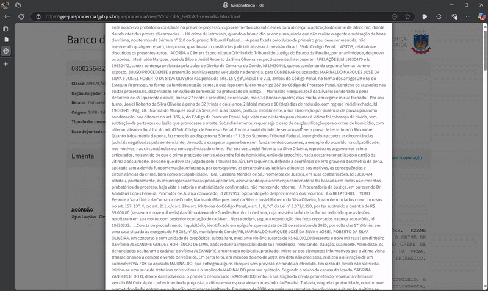

# JudAssistant: Análise de Acórdãos Jurídicos com LLMs

Este projeto é uma prova de conceito para análise automatizada de acórdãos jurídicos utilizando LLMs.
O objetivo é demonstrar a aplicação prática de LLMs em tarefas de classificação, extração, resumo técnico estruturado e interação humana (QA).

## Fonte dos Dados

Os acórdãos foram coletados do [Espelho de Acórdãos do STJ](https://dadosabertos.web.stj.jus.br/dataset/espelhos-de-acordaos-segunda-turma). \
Também, foi utilizado processos extraídos do [Banco de Jurisprudência do Tribunal de Justiça da Paraíba](https://pje-jurisprudencia.tjpb.jus.br/).

> Para mais detalhes veja o [README.md em `docs/acordao_examples`](docs/acordao_examples/README.md)

## Tarefas

Foram implementadas as tarefas de resumo, classificação, extração e QA humano. \
Os prompts de cada tarefa estão descritos em [utils/prompt_helpers.py](utils/prompt_helpers.py)

Segue uma breve explicação da relevancia de cada tarefa e algumas técnicas utilizadas.

### Geração de resumo técnico estruturado

Facilita a compreensão rápida do acórdão por resumir os dois pontos principais que existem em todo processo julgado: **Ementa** e **Decisão**.

### Classificação do documento

Realiza dois tipos de classificação:

1. Organiza o acórdão em categorias jurídicas principais (_administrativo_, _cível_, _penal_, _trabalhista_, _tributário_ e _outro_), permitindo futuramente uma filtragem automatizada;

2. Classifica a decisão em uma das três categorias: _favorável_, _desfavorável_ ou _neutro_.

Para classificação, foi necesessário utilizar o recurso de saídas estruradas (tanto do Ollama como Langchain), em que a camada de saída do modelo é modificada para forçar a resposta no schema determinado.

### Extração de entidades relevantes

Captura entidades essenciais para navegação e fundamentação jurídica, como:

1. Classe do processo: Ex.: Recurso Especial, Agravo de Instrumento, etc;
2. Numero identificador do processo;
3. Entidade Julgadora: Ex.: Primeira Turma, Camara Criminal, etc;
4. Relator;
5. Lista de Pessoas Citadas;
6. Data de publicação;
7. Data de decisão;
8. Lista de Fundamentos Jurídicos (leis, súmulas e normas).

Assim como na task de classificação, aqui também foi necessário utilizar o recurso de saídas estruturadas.

> **Nota:** Para esta task, utilizei a técnica _one-shot prompting_, em que simulo uma mensagem do usuário (i.e., acórdão) e uma resposta do assistente (i.e., entidades estruturadas). Isso facilita para que o modelo siga o padrÃo de resposta para as próximas mensagens.\
> Tal estrutura pode ser encontrada na função `extraction_chat_messages(text)` em [`utils/promp_helpers.py`](utils/prompt_helpers.py)

### Input humano com QA contextualizado

Permite ao usuário fazer perguntas sobre o acórdão, com as respostas geradas considerando todo o contexto do documento.

Para essa atividade, incluí o acórdão como parte do _system prompt_. Com base nisso, a cada iteração, o modelo terá o documento como contexto

## Abordagens Adotadas

- **Prompt Engineering modularizado**  
  Cada tarefa possui seu próprio prompt dedicado, maximizando o controle de cada resposta.

- **Adaptador de LLM**  
  Implementado um padrão Adapter para unificar a comunicação entre diferentes providers de LLMs (Ollama localmente e OpenAI).

- **Controle de histórico no QA**  
  Implementado armazenamento de contexto para conversas interativas sobre o acórdão, simulando sessões de chat.

- **Validação das saídas**  
  Pydantic é utilizado para validação de saídas estruturadas nas tarefas de classificação e extração de entidades.

- **Modelos utilizados:**

  - Desenvolvimento: `llama3.2:3b` (via Ollama)
  - Produção: `gpt-4.1-nano` (via API OpenAI)

- **Leitura de documentos via OCR** \
  Extração de texto a partir de imagens como JPG ou PDF.
  Foi utilizada a engine do Tesseract.

## ⚙️ Resultados Práticos e Exemplos

Os resultados são demonstrados tanto no notebook [`notebooks/experiments.ipynb`](notebooks/experiments.ipynb) como pela aplicação através do streamlit.



> **Nota:** Foram testados acórdãos com ~9.000 tokens sem problemas de contexto.

### Como rodar o streamlit?

> **Importante**:
>
> - Para rodar os modelos de LLM de forma local é necessário baixar e instalar o [Ollama](https://ollama.com/download).
> - Para utilizar a feature de leitura de PDFs, baixe e instale o [Tesseract](https://tesseract-ocr.github.io/tessdoc/Installation.html).
> - Para rodar os modelos da openai, renomeie o `.env.example` para `.env` e dentro do arquivo insira sua chave da API.

Crie um novo ambiente python, acesse-o, instale as bibliotecas e execute a aplicação, como mostra o snippet a seguir:

```bash
python -m venv venv
source venv/bin/activate

pip install -r requirements.txt
streamlit run main.py
```

## Análise Crítica: Pontos Fortes, Limitações e Melhorias Futuras

**Pontos Fortes:**

- Arquitetura modular e facilmente extensível para outros providers.
- Suporte multi-provider (Ollama e OpenAI) com mudança mínima no código.

**Limitações Atuais:**

- Pequena perda de desempenho esperada em modelos locais por motivos de infraestrutura fraca.

**Sugestões de Melhorias Futuras:**

- Em produção, poderia-se considerar unir prompts em tarefas combinadas para otimizar chamadas, dependendo do custo/token e da performance do modelo.  
  Exemplo: classificação e extração de entidades em uma única chamada.
- Para acórdãos muito longos (i.e., maiores que o contexto do LLM), poderia-se adotar técnicas de sumarização incremental, como o [Map-Reduce](https://python.langchain.com/docs/tutorials/summarization/#map-reduce).
  - Não foi priorizado nesta POC, pois o `llama3.2:3b` suporta até 128k tokens e quanto o `gpt-4.1-nano` suporta 1 milhão tokens.
- Implementar mecanismo de fallback para casos onde a resposta do LLM seja inconsistente (ex: ausência de campos que deveriam estar preenchidos).
- Na tarefa do input humano, poderia contextualizar até x mensagens, mantendo sempre as mais recentes, e claro, mantendo sempre a primeira mensagem que é onde está o acórdão. Essa limitação evitaria dele perder o contexto do acordão caso a conversa se alongasse bastante.
- Implementação de RAG (Retrieval-Augmented Generation) para conjuntos de múltiplos documentos, havendo a possibilidade de consulta.
- Fine-tuning para personalizar LLMs para linguagem jurídica especializada.

## 📂 Estrutura do Projeto

```yaml
/docs/                 # Documentos de acórdãos (txt, json)
/main.py               # Aplicação Streamlit (versão final)
/notebooks/            # Exemplos práticos da solução
/models/               # Classes da resposta estruturada
/utils/
    acordao_example.py # Exemplo de acórdão como string
    llm_adapter.py     # Carregamento e abstração do LLM
    prompt_helpers.py  # Templates de prompts
    task_handlers.py   # Funções para cada tarefa
README.md
requirements.txt
main.py                # Aplicação streamlit
```
